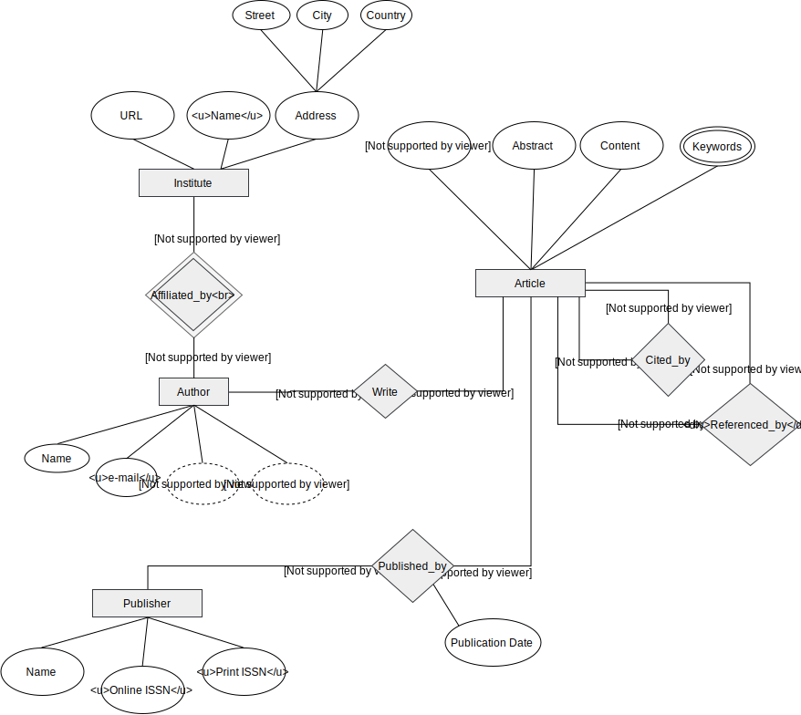

# DCC011 - Introdução ao Banco de Dados
> Yuri Diego Santos Niitsuma <*2011039023*>

## Exercício1

O domínio utilizado foi **Artigos Publicados**.

## Identificação

### Entidades
As entidades existentes são:
- **Article**: o artigo em si.
- **Author**: conjunto dos autores responsáveis pelo artigo.
- **Publisher**: a revista/jornal onde foi publicado.
- **Institute**: universidade, empresa, etc.

### Atributos e identificadores
##### Article
- **Title**: o título do artigo, utilizei como *primary key*.
- **Abstract**: o resumo inicial.
- **Content**: conteúdo do artigo (teoremas, experimentos, etc)
- **Keywords**: conjunto de palavras chave.

##### Author
- **Name**: nome do autor.
- **e-mail**: e-mail do autor. Utilizei como *primary key*.
- **Citation Count**: *atributo derivado* de quantas citações o autor recebeu.
- **Publication Count**: *atributo derivado* de quantas publicações foram feitas pelo autor.

##### Publisher
Utilizei o ISSN como *primary key* pois é único a cada publicação.
*Fonte*: http://www.ibict.br/informacao-para-ciencia-tecnologia-e-inovacao%20/centro-brasileiro-do-issn
- **Name**: nome da revista que publicou o artigo.
- **Online ISSN**: identificador para a versão online.
- **Print ISSN**: identificador para a versão impressa.

##### Institute
Utilizei o atributo **Name** como *primary key*.
- **Name**: nome da instituição. ex. UFMG.
- **URL**: link para o site da instituição. ex. https://www.ufmg.br/
- **Address**: atributo composto contendo o endereço da instituição.

### Relacionamentos e cardinalidade
##### Cited_by
Relaciona as citações entre os artigos.

##### Referenced_by
Relaciona as referências utilizadas pelo artigo.

##### Published_by
Relaciona qual editora o artigo foi publicado.
Contém o atributo da data da publicação.

##### Write
Relaciona cada artigo aos seus autores.

##### Affiliated_by
Qual instituto o autor pertence. Deixei como relacionamento de identficação pois há a possibilidade do autor ser um eremita :-).

<!-- pagebreak -->
### Diagrama ER

