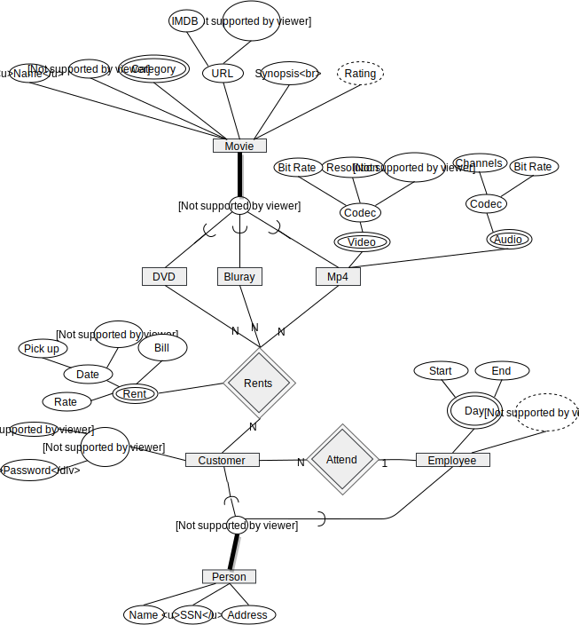

# DCC011 - Introdução ao Banco de Dados
> Yuri Diego Santos Niitsuma <*2011039023*>

## Exercício 2

O domínio utilizado foi **Locadora de filmes**.

## Identificação

### Entidades
As entidades existentes são:

- **Movie**, que derivam os produtos **DVD**, **Bluray** e para aluguel online **Mp4**.
- **Person**, que derivam **Employee** e **Customer**.

### Atributos e identificadores
##### Movie
- **Name**: o nome do filme. *primary key*
- **Year**: o ano de lançamento do filme. *primary key*
- **Category**: contendo categorias do filme.
- **URL**: contendo os links para o **IMDB** (Internet Movie Database) e **Rotten Tomatoes**, sites de catalogação e críticas dos filmes.
- **Synopsis**: contendo a sinópse do filme.
- **Rating**: a nota média dos usuários.

##### DVD, Bluray
Não contém atributo extra na especialização pois é apenas um objeto físico contendo a capa e disco.

##### Mp4
Arquivo de vídeo contendo as faixas de vídeo e audio (original ou dublado).

- **Video** é multivalorado pois é enviado ao cliente a qualidade dependente da taxa de transmissão da internet do cliente.
  - **Codec**
    - **Bitrate**: taxa de transmissão de dados, diretamente proporção a qualidade do vídeo.
    - **Resolution**: resolução do vídeo 4K, 1080p, etc.
    - **Frame Rate**: taxa de quadros por segundo
- **Audio** é multivalorado pois contém o audio original ou dublado do filme.
  - **Codec**:
    - **Channels**: stereo, 5.1, etc.
    - **Bitrate**: taxa de transmissão de dados, diretamente proporção a qualidade do audio.

- **Person**: Entidade que contém nome, SSN e endereço. Nada demais.

- **Customer**: O cliente que vai alugar os filmes.
  - **Online Account**: Possui este atributo contendo login e senha caso deseje alugar o filme digitalmente.

- **Employee**: O empregado.
  - **Day**: Contém o registro de entrada e saída no trabalho.
  - **Hours of Work**: auto explicativo.

### Relacionamentos e cardinalidade
##### Rents
"Quem aluga o que".

##### Attend
Caso empregado atende o consumidor na loja física.

<!-- pagebreak -->
### Diagrama ER

